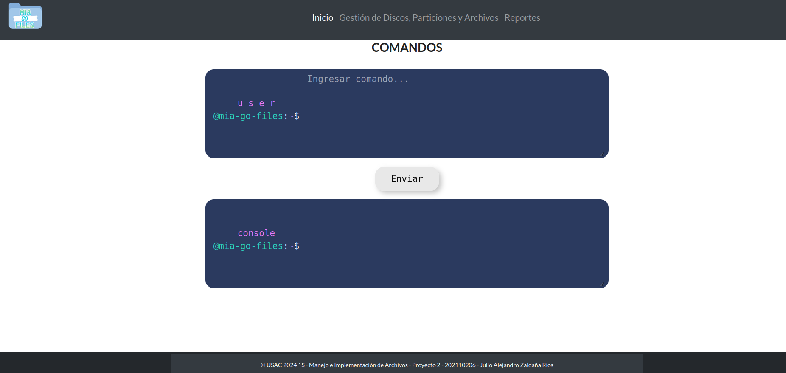
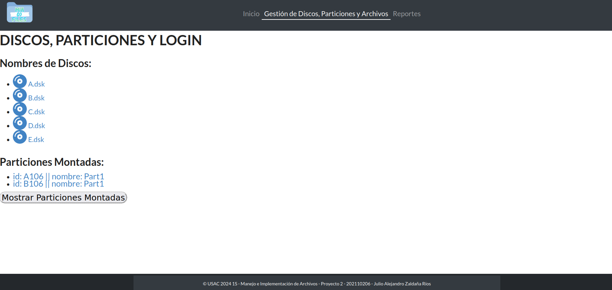
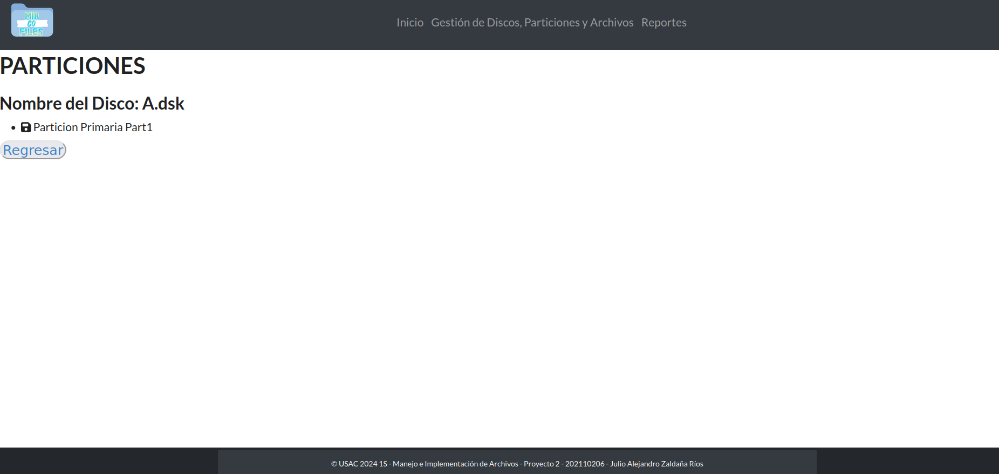
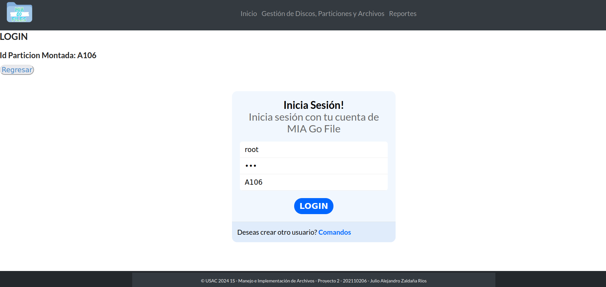
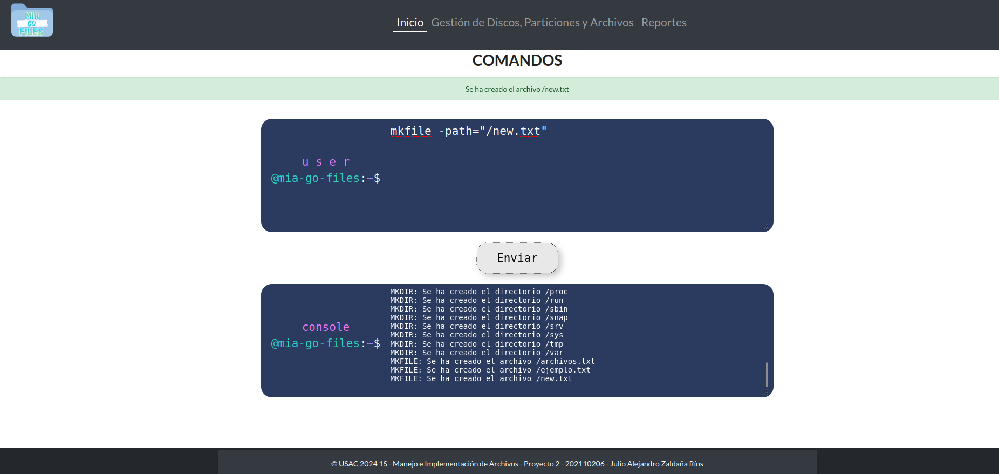
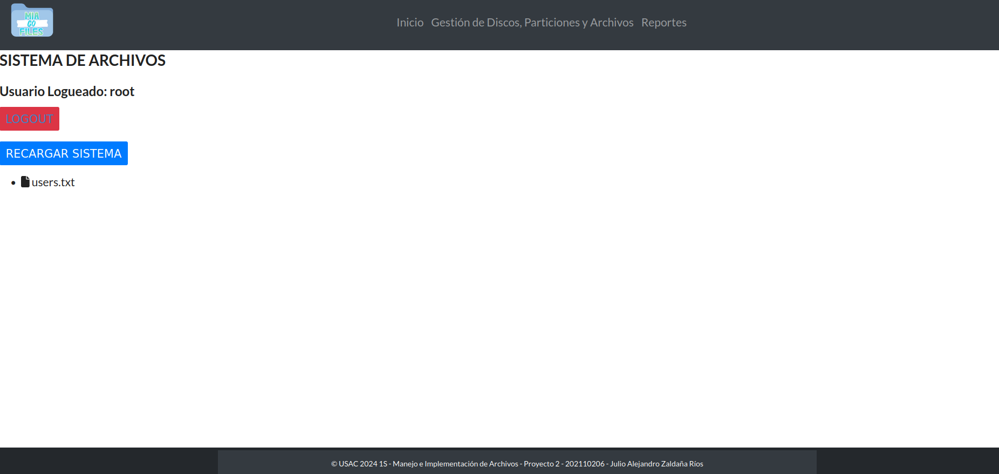
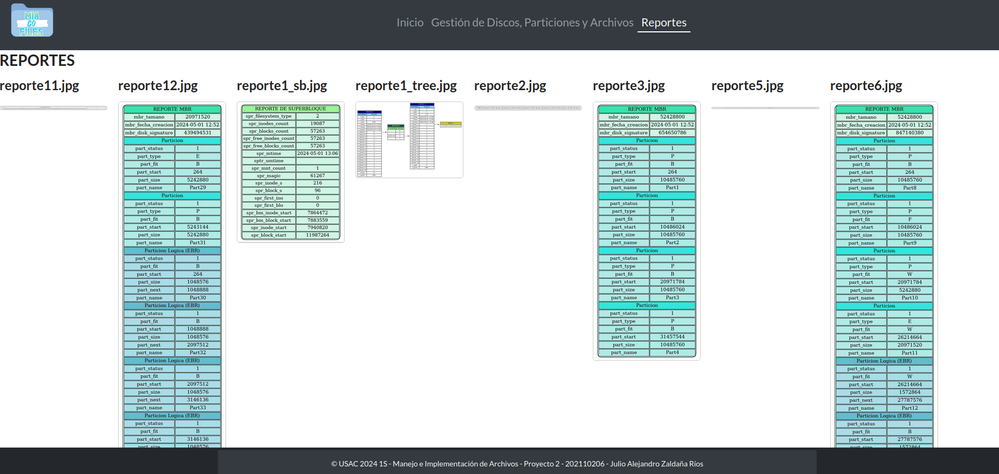

## UNIVERSIDAD DE SAN CARLOS DE GUATEMALA
## Repositorio - Proyecto 2
## Manejo e Implementación de Archivos - Sección "B"

Nombre: Julio Alejandro Zaldaña Ríos        
Carnet: 202110206

---------------------------------------------------------

El proyecto 2 del curso de Manejo e Implementación de Archivos se centró en realizar una interfaz gráfica (frontend) con React para desplegar y mostrar el analizador de comandos y manejo de sistemas de archivos, elaborado como Proyecto 1.

Aparte de realizar un frontend y un backend. Se desplegó el proyecto en general en Amazon AWS. 

Se utilizó una distribución EC2 para inicializar una maquina virtual y subir los archivos del backend, para inicializar el backend en la maquina virtual utilizando un host en Termius. Realizando una configuraciones con reglas de seguridad, y utilizando la IP pública como host. 

Se utilizó un bucket S3 para almacenar y subir la carpeta build generado al utilizar el comando:

* npm run build

Se cargó esa carpeta y los demás archivos al bucket S3, para desplegar el frontend; brindando un link parecido a:

http://mia-p2-202110206-1s2024.s3-website.us-east-2.amazonaws.com/

# Imagenes

Pantalla 1

Pantalla2

Login

Sistema de archivos

Pantalla 3 - Reportes

